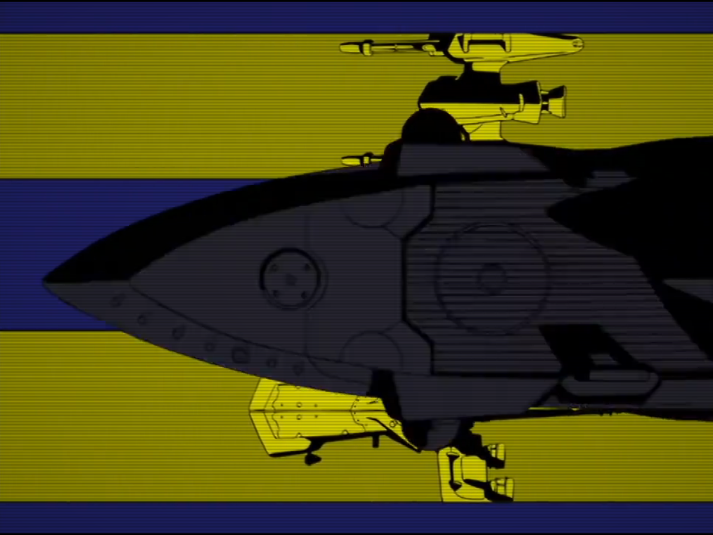
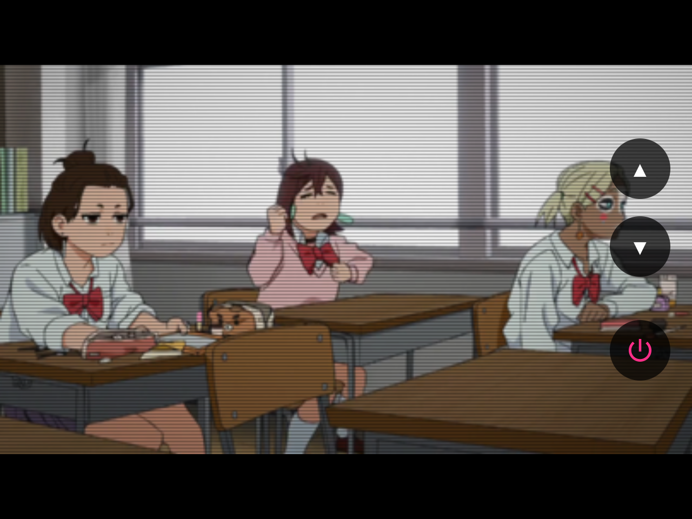
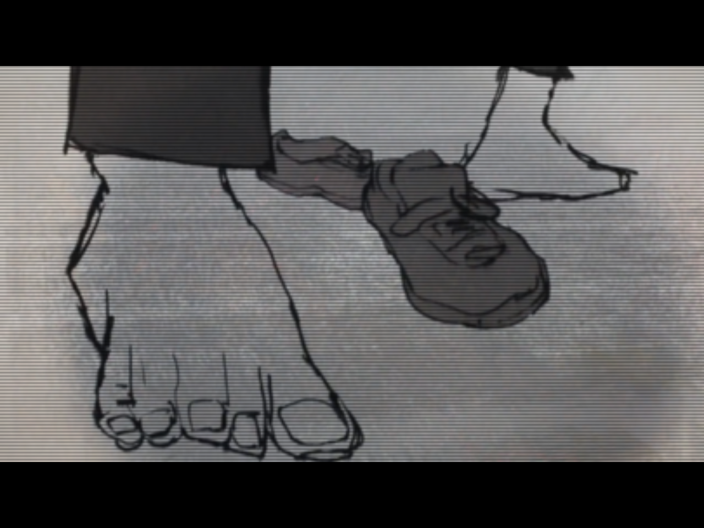
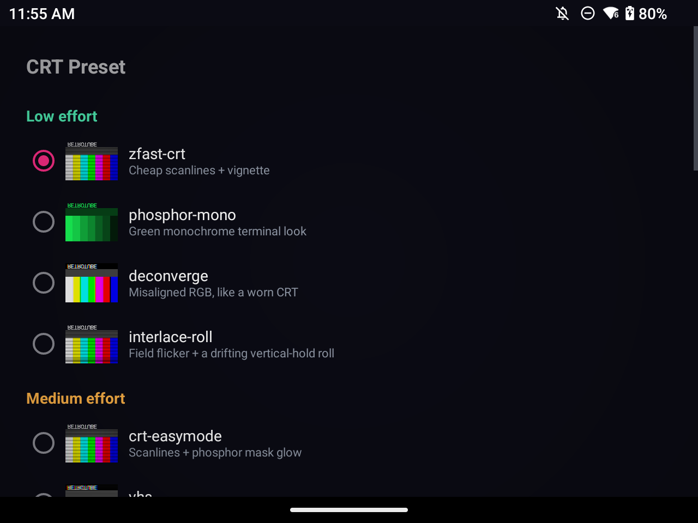
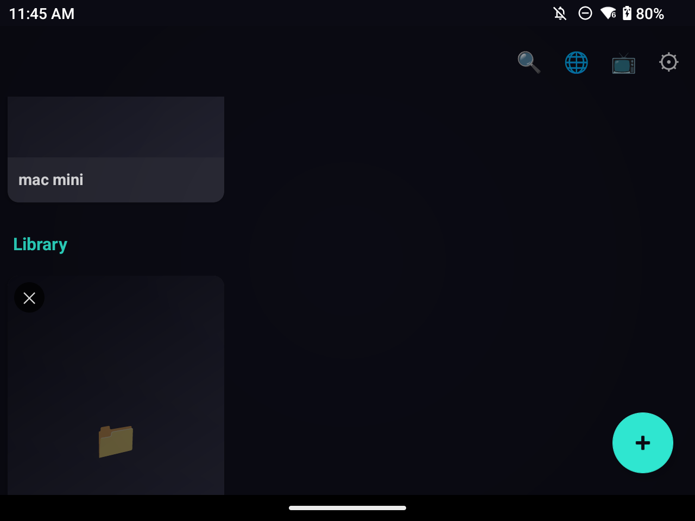
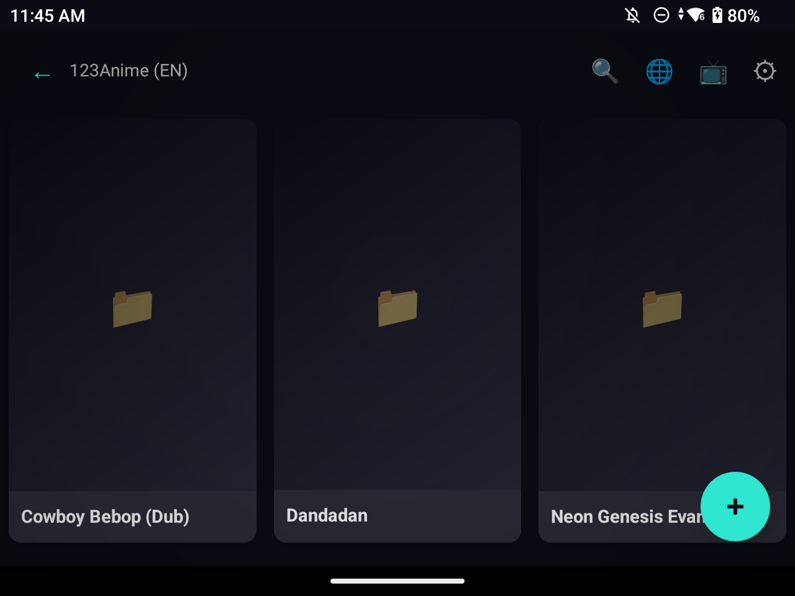
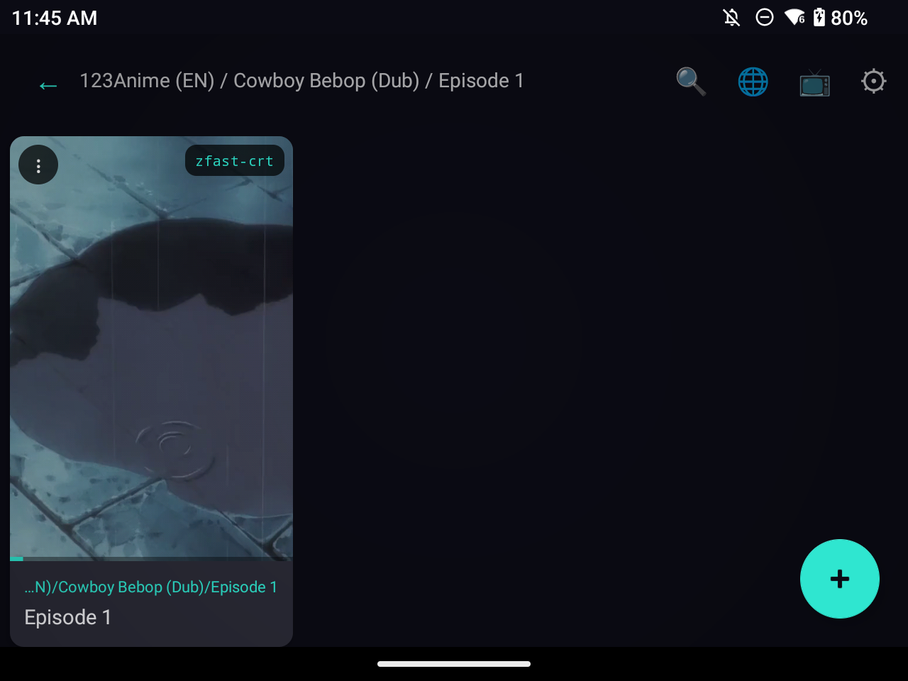
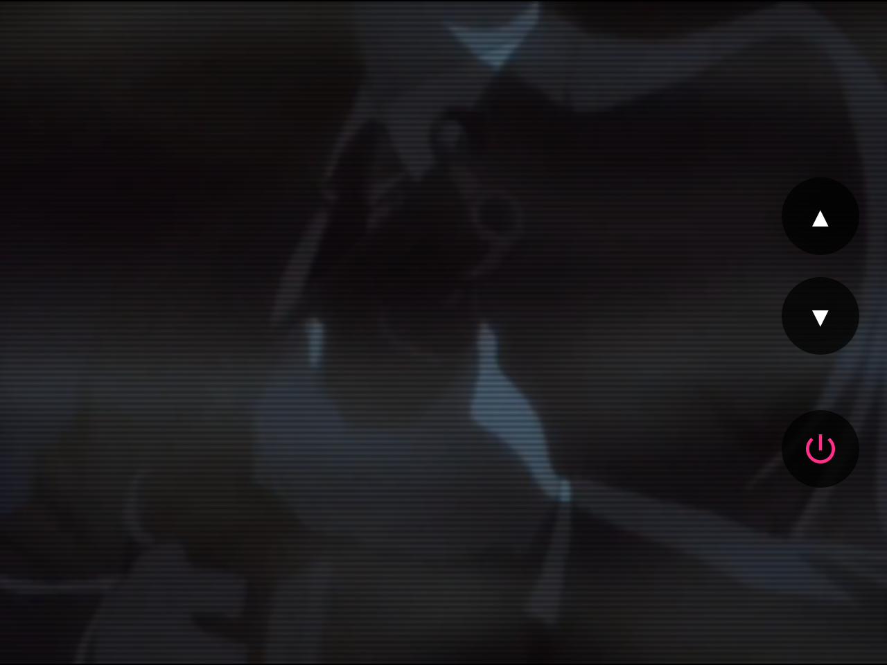
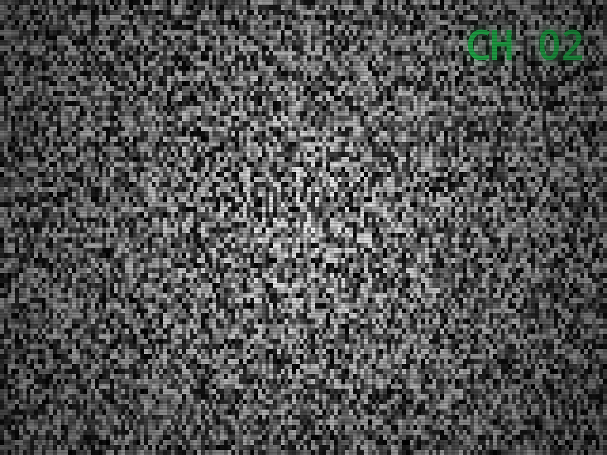
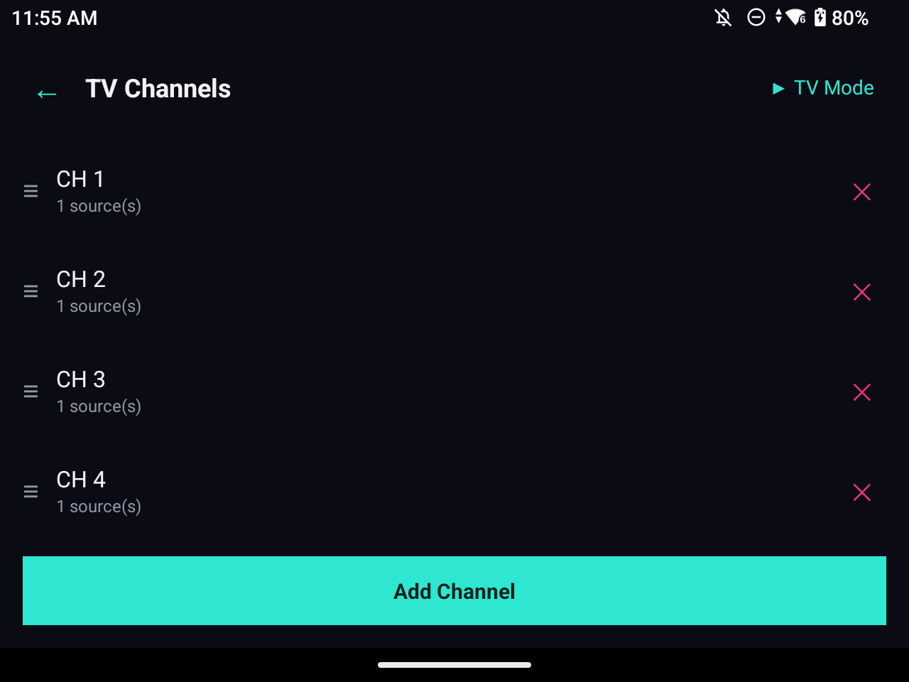

<div align="center">

# 📺 RetroTube

**Real, RetroArch-style CRT shaders for your video library — no emulator, no config file, no fuss.**

[](../../releases/latest)
[](LICENSE)
[](../../actions/workflows/build.yml)

</div>

Point RetroTube at a folder of videos — local or over SMB — and every episode plays back through a real CRT shader pipeline: scanlines, phosphor mask, chroma bleed, geometry warp, the works. Pick a look once as your default, override it per file, or build a whole ambient **TV Mode** channel lineup out of your own library. No RetroArch install, no shader config, no emulator core required.

<p align="center">
  
  
  
</p>

## Features

### 🖥️ Real CRT shading, not a filter
- **7 shader presets across 3 device-cost tiers**, each modeled on a real RetroArch preset family — pick based on how much GPU headroom your device has:
  - **Low**: `zfast-crt`, `phosphor-mono`, `deconverge`
  - **Medium**: `crt-easymode`, `vhs`
  - **High**: `crt-guest-advanced`, `ntsc`
- **Curvature** as an independent toggle — not baked into any one preset, so any preset can be combined with or without screen warp.
- **Resolution downscale pre-pass** with integer-scale snapping — forces the CRT math to run against a fixed low resolution (240p/480p/720p) snapped to a clean multiple of your screen height, so scanlines/mask read as chunky and authentic instead of a faint HD-video filter.
- **Aspect ratio modes** — fit (letterbox), stretch, or crop.
- **Global default + per-file override** — set a look for the whole library, or override it per file from the ⋮ menu on any video row.
- **A/B compare** — a "SHOW RAW" toggle built right into the player controls, to instantly flip between the shaded and raw video.

<p align="center">
  
</p>

### 📚 A real folder-tree library
- Point it at one or more folders via Android's Storage Access Framework, and browse them like actual folders — not a flattened dump of every file you own.
- **Connect an SMB share** and browse a NAS or another computer's shared folder the same way local folders work, including playback directly off the network.
- **Custom titles, tags, and poster art** per video — pick any photo as a poster, or grab a frame from the video itself.
- **Collections** — hand-curated, manually-orderable shelves that can pull videos together from anywhere in your library, local or network.
- **Continue Watching**, automatically, with resume-from-position on every video.

<p align="center">
  
  
  
</p>

### 📡 TV Mode — your own ambient channel lineup
Flip through channels like a real TV, with none of the setup a scheduling app would need:

- **You program the channels** — every library looks different, so there's no one fixed auto-derivation. Auto-generate a starting lineup from your folders/collections/shares, or build it from scratch: add whole folders, whole collections, individual videos, or browse into subfolders and nested files, one channel at a time.
- **No transport controls** — just channel up/down and a power button, styled after a real remote. Nothing to pause, nothing to scrub.
- **A beat of real tuner static** between channels, with a green CRT-style channel OSD drawn *through* the static's own scanlines — not floating on top of it.
- **Resume-aware** — flipping back to a channel picks up where you left off, and shows resume at the last-watched episode instead of a random spoiler-risk point. None of it touches your normal Continue Watching rail.
- **Gamepad shoulder buttons** (L1/R1) drive channel up/down in TV Mode, and previous/next video in normal playback — built for handhelds like the Retroid Nova.

<p align="center">
  
  
  
</p>

### 🎮 Built for handhelds
- **True fullscreen playback** — system status and gesture bars stay hidden through both normal playback and TV Mode.
- **Gamepad shoulder-button navigation**, everywhere video plays.

## Installing

Grab the latest APK from the [Releases](../../releases) page and sideload it.

> [!NOTE]
> Android will warn that the app "can't be verified" — that's expected for any sideloaded app not distributed through the Play Store, not a signing issue. Tap through to install anyway.

RetroTube isn't on the Play Store yet.

## Building from source

Requires the Android SDK (compileSdk 36) and JDK 17.

```bash
./gradlew :app:assembleDebug
```

The debug APK will be at `app/build/outputs/apk/debug/app-debug.apk`.

## Privacy

RetroTube has no accounts, no ads, and no analytics — everything it does happens on your device. See the [privacy policy](https://lynksdomain.github.io/retrotube/privacy-policy.html) for details.

## License

GPL-3.0. See [LICENSE](LICENSE). Contributions and forks are welcome; derivative works distributed publicly must also stay open source under the same license.
